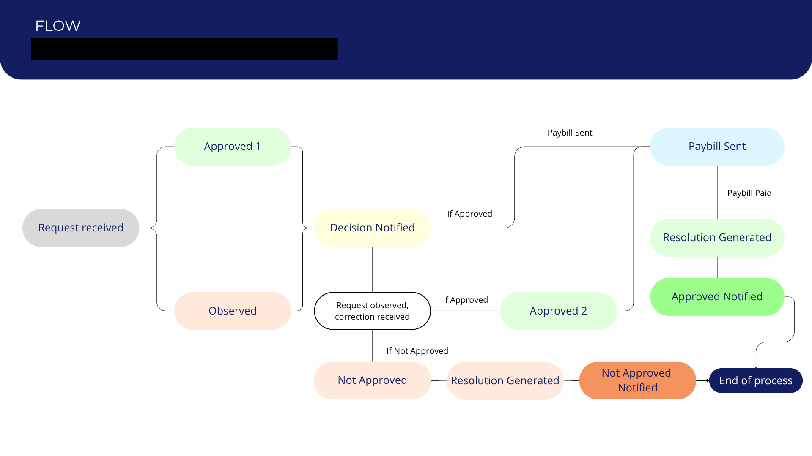

# Workflow Automations: Google Workspace
## Repository Overview

This repository presents a collection of workflow automation solutions I developed using Google Apps Script and other Google Workspace tools.

Here I present the following case studies, which address different operational challenges by automating repetitive processes, integrating multiple Google Workspace applications, and implementing business rules to improve operational efficiency.

The primary objective of these solutions was to reduce manual effort, minimize human error, standardize operational processes, and improve the reliability of the data used in day-to-day operations.

## Case Study 1: Automated Resolution Generation Workflow

### Project Summary

| | |
|---|---|
| **Domain** | Process Automation |
| **Project Type** | Workflow Automation |
| **Platform** | Google Workspace |
| **Main Technologies** | Google Apps Script, Google Sheets, Google Forms, Google Docs |
| **Primary Skills** | Workflow Design, Business Process Automation, Data Validation, Process Standardization |

### What's the bussiness problem?

Administrative requests were submitted through Google Forms and required analysts to manually track each request, calculate procedural deadlines, update statuses, and prepare official resolution documents.

This process involved repetitive data entry, manual date calculations, and document generation, increasing processing time and the possibility of human error.

---
### Solution

Developed a workflow automation solution using Google Apps Script that integrated Google Forms, Google Sheets, and Google Docs to automate the request lifecycle from submission to document generation.

The automation continuously monitored the status of each request within Google Sheets. As statuses changed, the script automatically updated key procedural dates by calculating business-day deadlines while considering institutional holidays, ensuring compliance with administrative timelines.

Once a request reached the **"Resolution Generated"** stage, the script retrieved the corresponding information, populated a predefined Google Docs template by replacing placeholder fields with applicant data, and generated a standardized PDF resolution ready for review and signature.

This approach eliminated repetitive manual document preparation, reduced calculation errors, and ensured consistency throughout the administrative process.
#### This approach eliminated repetitive manual document preparation while ensuring consistency across all generated resolutions.
---
### Process Automation

The following process map illustrates the administrative workflow supported by the automation.

The automation was designed around key workflow statuses, where each status triggered specific business rules:

| Status | Automated Action |
|--------|------------------|
| **Approved 1** | Recorded the corresponding process date for traceability. |
| **Observed** | Recorded the observation date and automatically calculated the correction deadline using business days while excluding institutional holidays. |
| **Approved 2** | Same as before, but used only after the first status was **Observed** |
| **Resolution Generated** | Retrieved applicant information, populated a Google Docs template, generated the official PDF resolution, and recorded the resolution generation date. |
| **Mandate Sent** | Recorded the payment notice date and generated the information required to prepare the payment order. |
| **Favorable Notification** | Updated the notification date for process traceability. |
| **Unfavorable Notification** | Updated the notification date for process traceability. |

Throughout the workflow, the automation maintained a complete audit trail by automatically recording key process dates, allowing every administrative milestone to be tracked throughout the request lifecycle.

### Impact

- **Reduced** repetitive administrative tasks through workflow automation.
- **Minimized** manual transcription and date calculation errors.
- **Standardized** the generation of official resolution documents.
- **Improved** processing efficiency by reducing manual intervention.
---

